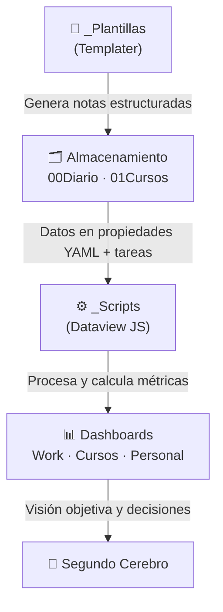

<div align="center">

# 🏛️ Akropolis-Vault

### *Personal Knowledge Management & Second Brain*

<em>«Aunque todo lo demás sea capturado, Zeus concede a su hija predilecta Atenea que solo un muro de madera permanecerá sin caer, el cual os salvará a ti y a tus hijos...» — Oráculo de Delfos, 480 a.C.</em>

<br>


<br>

**Un sistema de gestión del conocimiento personal (PKM) construido sobre Obsidian**
**para transformar el caos de la información diaria en sabiduría estructurada.**

</div>

## 🌍 Proyecto de Código Abierto

Este repositorio como **código abierto** bajo licencia **GPL-3.0**. Es un proyecto **vivo, en constante evolución**, y estaré atento para seguir puliéndolo e incorporando mejoras.

> [!TIP]
> **Será un placer escucharte**
> ¿Tienes sugerencias, ideas o encontraste una mejora? Estaré encantado de recibirlas. Podemos conectar y comunicarnos a través de:
>
> 💼 **LinkedIn:** [Juliam Guerrero Diaz](https://www.linkedin.com/in/juliamguerrero/)
>
> 📧 **Correo:** [juliamguerrerodz@gmail.com](mailto:juliamguerrerodz@gmail.com)
>
> 🐙 **GitHub:** [JULIAMGUERRERO](https://github.com/JULIAMGUERRERO)


## 📜 El Origen del Nombre: ¿Por qué *Akropolis*?

En la antigua Grecia, la **`polis`** era la ciudad viva: el ágora, el mercado, los encuentros y toda la riqueza de la vida cotidiana. Sobre ella se alzaba la **`akrópolis`** (literalmente *"la ciudad alta"*), la ciudadela elevada y sagrada que complementaba esa vida guardando lo más valioso: los templos, el tesoro común y los archivos del conocimiento.

Tu día a día —las tareas, el trabajo, las conversaciones, las mil ideas que surgen— es tu propia *polis*: valiosa y llena de energía. **`Akropolis-Vault` es la ciudad alta que la acompaña**: un espacio sereno y elevado donde tus ideas, aprendizajes y proyectos a largo plazo quedan resguardados, de modo que ninguna reflexión importante se pierda entre el ritmo del día.

> [!NOTE]
> **La analogía en tres columnas**
> -  **Resiliencia Mental:** así como la Acrópolis custodiaba con firmeza lo esencial de la comunidad, tu segundo cerebro es el lugar donde tus ideas descansan seguras, protegidas del olvido y liberándote de la carga de recordarlo todo.
> -  **Gestión del Conocimiento:** la Acrópolis de Atenas resguardaba el fondo común más valioso de la ciudad y sus aliados, el capital reservado para las decisiones importantes. Del mismo modo, este sistema no solo guarda notas: es el *banco central* de tus aprendizajes, un capital de conocimiento listo para invertirse cuando lo necesites.
> -  **Claridad y Enfoque:** la Acrópolis se veía desde toda la región y servía de guía. Cuando el día te absorbe en los detalles, basta con mirar a tu segundo cerebro para reencontrar la visión general y tu propósito.

### 🏛️ El Partenón de las Ideas

La estructura más célebre de la Acrópolis, el **Partenón**, un edificio diseñado para albergar la estatua de **Atenea** (diosa de la sabiduría y la estrategia) y para **proteger los archivos de la ciudad**. `Akropolis-Vault` toma ese mapa arquitectónico:

- Las **columnas** son las áreas clave de tu vida —salud, estudios, productividad— que sostienen el techo (tu propósito).
- La **Cella** (el santuario interior) es tu base de datos central de conocimiento puro, protegida del ruido exterior.

### 🧭 La lección del "Muro de Madera"

En el año 480 a.C., Grecia enfrentaba la amenaza del Imperio Persa. Ante la incertidumbre, los atenienses consultaron al Oráculo de Delfos, que respondió con un enigma: **«Aunque todo lo demás sea capturado, Zeus concede a su hija predilecta Atenea que solo un muro de madera permanecerá sin caer, el cual os salvará a ti y a tus hijos...»**.

Muchos interpretaron el mensaje de forma **literal y rígida**, confiando en levantar una empalizada de madera alrededor de la Acrópolis. Pero el estratega **Temístocles** lo leyó con **visión y flexibilidad**: el verdadero "muro de madera" eran los **barcos** de la flota. Gracias a esa interpretación, la población pudo ponerse a salvo a tiempo y Atenas preservó a su gente y su futuro en la decisiva jornada naval de **Salamina**.

> [!IMPORTANT]
> **Por qué esto define al proyecto**
> Esta historia encarna la diferencia entre **almacenar información de forma rígida** e **interpretarla con criterio**. Un segundo cerebro no te ayuda por encerrarte en estructuras inflexibles, sino porque te ofrece las herramientas y la perspectiva para **leer tus propios datos y tomar mejores decisiones** en los momentos que importan. `Akropolis-Vault` es ese "muro de madera": un sistema dinámico que te ayuda a mantener el rumbo y prevalecer con claridad.

---

## 🧠 ¿Por qué usar un Segundo Cerebro?

Tu mente biológica es brillante para **tener ideas**, pero terrible para **almacenarlas**. Un segundo cerebro externaliza la memoria para que tu cabeza quede libre para lo que de verdad importa: pensar, conectar y crear.

| Sin segundo cerebro | Con `Akropolis-Vault` |
| :--- | :--- |
| 🌀 Las ideas se pierden en el ruido diario | 🏛️ Todo queda capturado y estructurado |
| 🔁 Repites aprendizajes que ya hiciste | 🔗 Conectas notas, cursos y días entre sí |
| 😵 Sensación constante de sobrecarga | 🔦 Perspectiva elevada y objetiva de tu vida |
| ❓ Decides "a ojo", sin datos | 📊 Dashboards que aportan objetividad medible |

---

## ⚙️ ¿Cómo Funciona el Proyecto?

`Akropolis-Vault` se organiza en cuatro capas que trabajan juntas: **capturas** información con plantillas, la **almacenas** en carpetas ordenadas, unos **scripts** la procesan y los **dashboards** te la devuelven convertida en gráficos y decisiones.



### 🗂️ 1. Estructura de Carpetas

| Carpeta | Propósito |
| :--- | :--- |
| **`00Diario/`** | Notas diarias. Cada día reúne automáticamente todas las notas de estudio de tus cursos vinculadas a esa fecha, y permite anexar acontecimientos y tareas personales del día. |
| **`01Cursos/`** | Espacio de estudios, organizable a tu gusto en subcarpetas (por ejemplo `Doctorado/`, `Especializaciones_Online/`). Cada carpeta invoca sus plantillas correspondientes para mantener el orden. |
| **[`_Plantillas/`](_Plantillas/README.md)** | Las plantillas Templater que automatizan la creación de notas. *(Ver documentación detallada en su README).* |
| **[`_Scripts/`](_Scripts/README.md)** | El motor de análisis: scripts JavaScript que alimentan los dashboards. *(Ver documentación detallada en su README).* |
| **[`_assets/`](_assets/README.md)** | Repositorio central de recursos visuales: capturas de los dashboards, logos, banners e imágenes que ilustran la documentación. Mantener aquí todo el material gráfico ayuda a conservar el vault ordenado y evita imágenes sueltas entre las notas. |

### 📝 2. Plantillas (la captura automatizada)

- **`01CursosPadre.md` → Curso Principal (Padre):** representa un programa o especialización completo (p. ej. una ruta doctoral). Guarda propiedades clave: plataforma, estado, dificultad, relevancia para la tesis, fechas y progreso.
- **`01CursosHijo.md` → Subcurso (Hijo):** se vincula a un curso padre y, mediante una **pregunta interactiva de Templater** ("¿Cuántos módulos tiene?"), genera dinámicamente su estructura de **módulos, objetivos, metas, lecciones, notas, dudas y tareas**. Incluye botones **Meta Bind** para añadir lecciones o notas con un solo clic.
- **`01PlantillaNotaEstudio.md` → Nota de Estudio:** bloque de bitácora con notas, conclusiones, **pendientes** (`#pendiente`) y **dudas** (`#duda`) fechadas, que luego se agregan y visualizan en el diario y los dashboards.
- **`00PlantillaDiario.md` → Diario:** genera la nota del día con navegación entre días, tablas de tareas en proceso y espacio para apuntes rápidos.

> **El vínculo Padre → Hijo → Nota → Diario** es el corazón del sistema: todo lo que estudias queda enlazado y consultable desde cualquier punto de vista (por curso, por día o por métrica).

### 📊 3. Dashboards (la perspectiva elevada)

Los paneles convierten tus datos crudos en **objetividad visual** mediante el plugin *Charts* y los scripts de `_Scripts/`:

- **`Dashboard-01Work`** — 📈 Rendimiento y flujo de trabajo: balance semanal de tareas creadas vs. resueltas, flujo diario y métricas de energía, sueño y estado de ánimo.
- **`Dashboard-02Cursos`** — 🗺️ Mapa de contenido (MOC) de tus programas: cursos en proceso vs. finalizados, catálogo de subcursos con su progreso, y la evolución acumulativa de tu aprendizaje.
- **`Dashboard-03Personal`** — 🏃 Deporte & Fitness: constancia y rachas de entrenamiento, enfoque muscular, disciplinas practicadas y correlación entre carga física, peso y descanso.

#### 🖼️ Vista Previa

<div align="center">

**📈 Dashboard-01 · Rendimiento y Flujo de Trabajo**


<br><br>

**🗺️ Dashboard-02 · Mapa de Contenido de Cursos**


<br><br>

**🏃 Dashboard-03 · Deporte & Fitness**


</div>

---

## 🔌 Plugins Necesarios

Lista de plugins que se necesita instalar:

- Google Drive Sync
- Dataview
- Templater
- Meta Bind
- VSCode Editor
- Charts
- Tasks

# Guía de Instalación y Configuración
---
## 1. #GoogleDriveSync / OPCIONAL
> [!NOTE]
> **Propósito.** Mantiene todo tu baúl de Obsidian respaldado y sincronizado automáticamente en la nube utilizando tu cuenta de Google Drive de forma gratuita. 
> 
> **Nota importante (Opcional & Personal):** La configuración de este plugin es **totalmente opcional**. Se incluye para quienes deseen sincronizar su información personal entre múltiples plataformas (macOS, Windows, Linux, Android, iOS y iPadOS) y así sacarle el mayor provecho a `Akropolis-Vault`. Toda la información procesada por este plugin es **estrictamente personal** y vive únicamente en tu cuenta privada de Google Drive.

### 📋 Configuración Inicial

Para evitar alertas de conflicto (*"Vault is not empty"*) al conectar Google Drive por primera vez en cualquier equipo o dispositivo móvil, se debe realizar el proceso en este orden estricto:

- **1. Preparar la Bóveda Vacía**
	- [ ] Descargar e instalar la aplicación oficial de **Obsidian**.
	- [ ] Crear una nueva bóveda local con el nombre exacto: `Akropolis-Vault`.
	- [ ] **Importante:** Asegurarse de que la bóveda esté totalmente vacía (sin notas ni carpetas previas).

- **2. Instalar y Conectar el Plugin `Google Drive Sync`**
	- [ ] Abrir Ajustes ⚙️ (`Ctrl + ,` / `Cmd + ,`).
	- [ ] Ir a **Plugins de la comunidad** (*Community plugins*) y activarlos si es necesario.
	- [ ] Hacer clic en **Explorar** (*Browse*), buscar `Google Drive Sync` e instalarlo.
	- [ ] Activar el plugin y entrar en sus opciones.
	- [ ] Hacer clic en **Get refresh token** / **LogIn** (esto abrirá una ventana en tu navegador externo para iniciar sesión con tu cuenta de Google).
	- [ ] Iniciar sesión, autorizar los permisos y **copiar el token de actualización** que te entregará Google.
	- [ ] Pegar el token en el campo *Refresh token* dentro de Obsidian.
	- [ ] **Reiniciar Obsidian** (`Cmd + Q` en Mac / `Alt + F4` en Windows) para activar la sincronización.
	- [ ] Al abrir nuevamente Obisdian, pulsar el botón de **sincronizar / push** (⬆️ a la izquierda) para cargar todos los nuevos archivos del git a la nube.

> [!TIP]
> **El paso 3 solo se realiza una vez.** La carga inicial vía **git** únicamente es necesaria en tu **primer dispositivo**. Una vez que el baúl vive en tu Google Drive, en tus **demás dispositivos** basta con:
> 1. Instalar y conectar el plugin `Google Drive Sync` (paso 2).
> 2. Cada vez que abras Obsidian, este se cargara con las ultimas modificaciones cargadas en alguno de tus dispositivos.
>
> De este modo puedes **omitir el paso 3** en el resto de equipos: tus archivos se sincronizarán directamente con el plugin, sin volver a usar la terminal.


- **3. Cargar los Archivos del Repositorio (Vía Terminal)**
	- [ ] Abrir la Terminal (en Mac/Linux) o PowerShell/Git Bash (en Windows).
	- [ ] Navegar hasta la ruta donde se creó tu bóveda local:
	  ```bash
	  cd "PATH/Akropolis-Vault"
	  ```
	- [ ] Inicializar y descargar todo el contenido del repositorio directamente en el directorio actual:
	  ```bash
	  git init
	  git remote add origin https://github.com/JULIAMGUERRERO/Akropolis-Vault.git
	  git fetch origin
	  git checkout -f main
	  git reset --hard origin/main
	  ```
	- [ ] Abrir nuevamente Obsidian. Todas tus notas y carpetas aparecerán cargadas y el plugin `Google Drive Sync` comenzará a respaldar todo en tu Google Drive automáticamente.

---
## 2. #Complementos_Principales 

> [!NOTE]
> **Propósito.** Estos complementos ya vienen integrados en Obsidian (no requieren instalación desde la comunidad); solo hay que **activarlos y configurarlos**. Son los que conectan tus plantillas con la creación automática de notas diarias.

### 📋 Configuración

- **1. Plantillas (*Templates*)**
	- [ ] Ir a **Ajustes** ⚙️ ➔ **Plantillas** (menú lateral izquierdo).
	- [ ] **Template folder location** (*Ubicación de la carpeta de plantillas*): seleccionar la carpeta `_Plantillas`.

- **2. Notas Diarias (*Daily notes*)**
	- [ ] Ir a **Ajustes** ⚙️ ➔ **Notas diarias** (menú lateral izquierdo).
	- [ ] **New file location** (*Ubicación del nuevo archivo*): seleccionar la carpeta `00Diario`.
	- [ ] **Template file location** (*Ubicación de la plantilla*): seleccionar `_Plantillas/00PlantillaDiario`.

---
## 3. #Dataview
> [!NOTE]
> **Propósito.** Esta lista asegura que todas las consultas de tablas, barras de progreso y propiedades dinámicas funcionen correctamente en cualquier nuevo dispositivo.
### 📋 Configuración

- **1. Instalar el Plugin Dataview**
	- [ ] Abrir Ajustes
	- [ ] Ir a **Plugins de la comunidad** (*Community plugins*).
	- [ ] Hacer clic en **Activar plugins de la comunidad** (si el baúl es nuevo).
	- [ ] Hacer clic en **Explorar** (*Browse*), buscar `Dataview` e instalarlo.
	- [ ] Hacer clic en **Activar** (*Enable*).

- **2. Habilitar Ajustes Obligatorios de Ejecución**
	- [ ] Ir a **Ajustes** ⚙️ ➔ **Dataview** (al final de la barra lateral).
	- [ ] **Activar:** `Enable JavaScript Queries` *(Permite ejecutar código JS para tablas complejas, porcentajes y barras de progreso)*.
	- [ ] **Activar:** `Enable Inline JavaScript Queries` *(Permite leer datos JS en una sola línea)*
	- [ ] **Activar:** `Enable Inline Queries` *(Permite mostrar campos en línea)*

---

# 4. #Templater

> [!NOTE]
> **Propósito.** Permite automatizar la creación de subcursos mediante preguntas interactivas (como el número de módulos) y generar estructuras dinámicas con código en Javascript dentro de Obsidian.
## 📋 Configuración

- **1. Descargar e Instalar el Plugin**
	- [ ] Abrir **Ajustes** ⚙️ (`Ctrl + ,` en Windows / `Cmd + ,` en Mac).
	- [ ] Ir a **Plugins de la comunidad** (*Community plugins*).
	- [ ] *(Si es la primera vez)* Hacer clic en **Activar plugins de la comunidad**.
	- [ ] Hacer clic en **Explorar** (*Browse*) y buscar `Templater`.
	- [ ] Hacer clic en **Instalar** (*Install*) y luego en **Activar** (*Enable*).

- **2. Configurar Carpetas y Opciones Clave**
	- [ ] Ir a **Ajustes** ⚙️ ➔ menú lateral izquierdo ➔ **Templater**.
	- [ ] **Template folder location:** Seleccionar la carpeta donde guardas tus plantillas (ejemplo: `_Plantillas`).
	- [ ] **Trigger Templater on new file creation:** Activar 🟢 *(Opcional: ejecuta la plantilla en cuanto creas un archivo nuevo en carpetas asignadas)*.
	- [ ] **Enable User System Command Functions:** Activar 🟢 *(Permite la ejecución de scripts avanzados si los necesitas a futuro)*.

- **3. Asignar un Atajo de Teclado (Recomendado)**
	- [ ] Ir a **Ajustes** ⚙️ ➔ **Atajos de teclado** (*Hotkeys*).
	- [ ] Buscar `Templater: Open Insert Template modal`.
	- [ ] Asignar la combinación de teclas preferida (por defecto suele ser `Alt + N`).
	
	## 🔍 Verificación de Funcionamiento
	- [ ] Crear una nota de prueba en cualquier carpeta.
	- [ ] Presionar `Alt + N` (o `Ctrl + P` -> escribir *Templater: Open Insert Template modal*).
	- [ ] Comprobar que se abre la lista flotante con las plantillas disponibles en tu carpeta `_Plantillas`.

# 5. #Meta_Bind

> [!NOTE]
> **Propósito.** Permite insertar botones interactivos en los módulos para añadir lecciones o notas secundarias con un solo clic sin romper el formato.

## 📋 Checklist de Configuración

- **1. Instalar Meta Bind**
	- [ ] Ir a **Ajustes** ⚙️ ➔ **Plugins de la comunidad**.
	- [ ] Buscar `Meta Bind` e instalarlo.
	- [ ] Activar el plugin.

- **2. Integración con Templater**
	Usar el bloque de código `` ```meta-bind-button `` dentro de la plantilla del módulo para vincular la creación automática de lecciones.
# 6. #VSCode_Editor

> [!NOTE]
> **Propósito.** Permite configurar un entorno de desarrollo moderno e interactivo para editar código, gestionar notas y trabajar de forma eficiente sin romper el formato ni la estructura de tu flujo de trabajo.

## 📋 Checklist de Configuración

- **1. Instalar VS Code**
	- [ ] Ir a **Ajustes** ⚙️ ➔ **Plugins de la comunidad**.
	- [ ] Buscar `VSCode Editor` e instalarlo.
	- [ ] Activar el plugin.

# 7. #Charts

> [!NOTE]
> **Propósito.** Visualizar el historial de productividad, picos de trabajo y patrones de comportamiento mediante gráficos interactivos.

## 📋 Checklist de Configuración

- **1. Instalar Charts**
	- [ ] Ir a **Ajustes** ⚙️ ➔ **Plugins de la comunidad**.
	- [ ] Buscar `Charts` e instalarlo.
	- [ ] Activar el plugin.

# 8. #Task

> [!NOTE]
> **Propósito.** Permite automatizar el registro de fechas en la resolución de tareas

## 📋 Checklist de Configuración

- **1. Instalar Meta Bind**
	- [ ] Ir a **Ajustes** ⚙️ ➔ **Plugins de la comunidad**.
	- [ ] Buscar `Task` e instalarlo.
	- [ ] Activar el plugin.
	[ ] Entrar a las **Opciones de Tasks ➔ Sección Dates** y activar:
	
		  - [ ] `Set done date on every completed task` *(Agrega automáticamente `✅ YYYY-MM-DD` al marcar `[x]`)*.
		  - [ ] `Set created date on every added task` *(Opcional: Agrega `➕ YYYY-MM-DD` al crear tareas).*

---

## � Versionado

Este proyecto sigue el estándar **[Versionado Semántico (SemVer)](https://semver.org/lang/es/)** con el formato `MAJOR.MINOR.PATCH`:

- **MAJOR** — cambios que rompen la compatibilidad (p. ej. reestructurar carpetas o renombrar propiedades que usan los scripts).
- **MINOR** — nuevas funciones compatibles hacia atrás (un dashboard o una plantilla nueva).
- **PATCH** — correcciones de errores y ajustes menores.

El historial completo de cambios de cada versión está documentado en el **[CHANGELOG.md](CHANGELOG.md)**, siguiendo la convención de [Keep a Changelog](https://keepachangelog.com/es-ES/).

> **Versión actual: `1.0.0`** — primera versión pública.

---

## �📄 Licencia

Este proyecto se distribuye bajo la licencia **GNU General Public License v3.0 (GPL-3.0)**. Eres libre de usar, estudiar, modificar y compartir el proyecto, siempre que las obras derivadas se mantengan igualmente abiertas bajo la misma licencia.

---

<div align="center">

### 🏛️ *«La sabiduría comienza en el asombro.»* — Sócrates

**Hecho con ❤️ y filosofía por [Juliam Guerrero Diaz](https://github.com/JULIAMGUERRERO)**

📧 [juliamguerrerodz@gmail.com](mailto:juliamguerrerodz@gmail.com)

⭐ *Si este proyecto te inspira o te es de utilidad, deja una estrella y construyamos juntos una mejor ciudadela del conocimiento.*

</div>